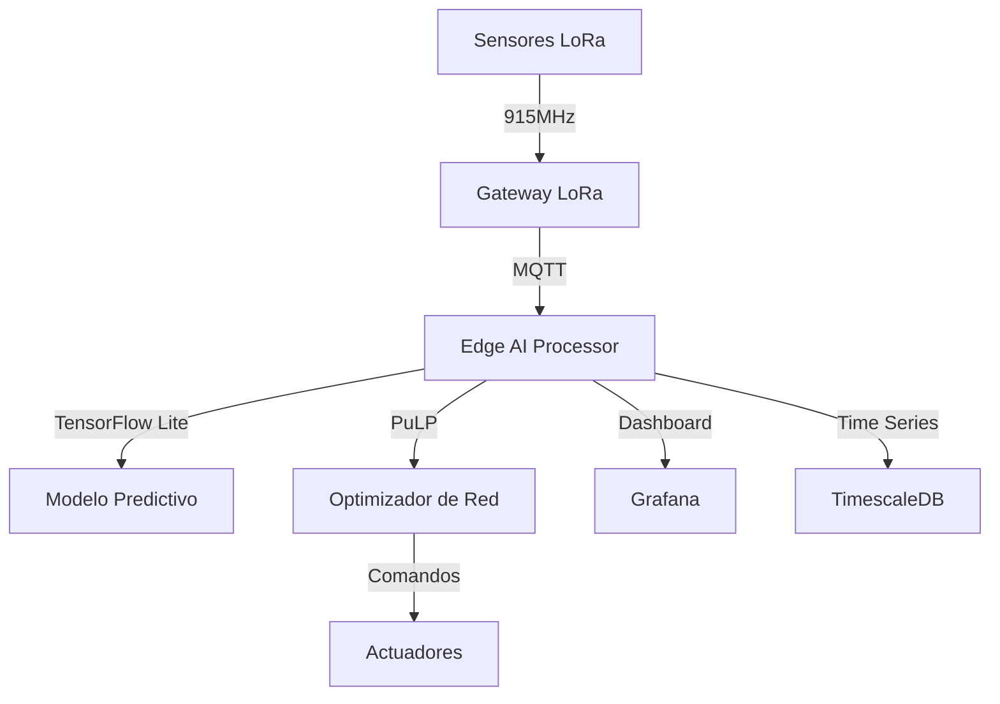

# 🚀 NexusOptim IA - Edge AI para Optimización Eléctrica

**Inteligencia Artificial en el Edge para la optimización de redes eléctricas en Costa Rica**

---

## 🌟 **Descripción**

NexusOptim IA es una plataforma de Edge Computing que utiliza Inteligencia Artificial para optimizar redes eléctricas, reducir pérdidas técnicas y mejorar la eficiencia energética. Diseñado específicamente para las condiciones de Costa Rica.

### 🎯 **Características Principales**

- 🧠 **IA Avanzada**: Modelos LSTM + Isolation Forest para predicción de fallos
- 📡 **Comunicación LoRa**: Alcance hasta 15km en zonas rurales  
- ⚡ **Tiempo Real**: Optimización automática cada 5 minutos
- 🔋 **Bajo Consumo**: Sensores con autonomía de 2+ años
- 🛡️ **Seguridad**: Encriptación AES-256 y certificación SUTEL
- 🌍 **Edge Computing**: Procesamiento local sin dependencia de internet

---

## 🏗️ **Arquitectura del Sistema**



---

## ⚡ **Instalación Rápida**

### **Opción 1: Script Automático (Windows)**
```cmd
setup_windows.bat
```

### **Opción 2: Manual**
```bash
# 1. Clonar repositorio
git clone https://github.com/OpenNexus/NexusOptim-IA.git
cd NexusOptim-IA

# 2. Crear entorno virtual
python -m venv nexusoptim_env
nexusoptim_env\Scripts\activate  # Windows
# source nexusoptim_env/bin/activate  # Linux/Mac

# 3. Instalar dependencias
pip install -r requirements.txt

# 4. Configurar variables de entorno
copy .env.example .env
# Editar .env con tus configuraciones

# 5. Ejecutar aplicación
python src/main.py
```

### **Opción 3: Docker (Recomendado para Producción)**
```bash
# Levantar todos los servicios
docker-compose up -d

# Ver logs
docker-compose logs -f nexusoptim-ai

# Parar servicios
docker-compose down
```

---

## 🔧 **Configuración**

### **Variables de Entorno Clave**
```bash
# LoRa Configuration (Costa Rica)
LORA_FREQUENCY=915000000  # 915 MHz (Banda ISM libre)
LORA_TX_POWER=14          # 14dBm (Máximo SUTEL)

# Sensores
ADS1115_I2C_ADDRESS=0x48
SCT013_CALIBRATION_FACTOR=0.066

# IA Models
MODEL_PATH=./models
PREDICTION_HORIZON=6      # Horas de predicción

# Optimización
LOSS_THRESHOLD=0.05       # 5% máximo de pérdidas
OPTIMIZATION_INTERVAL=300 # 5 minutos
```

---

## 🚦 **Uso**

### **1. Iniciar Sistema**
```bash
# Activar entorno
nexusoptim_env\Scripts\activate

# Ejecutar aplicación
python src/main.py
```

### **2. Acceder a Interfaces**
- **API REST**: http://localhost:8000
- **Documentación**: http://localhost:8000/docs
- **Dashboard**: http://localhost:3000 (Grafana)
- **Monitoreo**: http://localhost:8000/health

### **3. Configurar Sensores**
```python
# Ejemplo de configuración de sensor
from src.services.sensor_service import SensorService

sensor = SensorService()
await sensor.add_sensor(
    sensor_id="NXS_001",
    sensor_type="voltage",
    location="Subestación Orosi",
    coordinates={"lat": 9.7987, "lon": -83.8553}
)
```

---

## 📊 **Monitoreo y Alertas**

### **Métricas Clave**
- ⚡ **Pérdidas Técnicas**: % en tiempo real
- 🌡️ **Temperatura**: Sensores ambientales
- 📈 **Demanda**: Predicción 6h adelante
- 🔋 **Batería**: Estado de sensores remotos

### **Sistema de Alertas**
```python
# Configurar alerta por Slack
SLACK_WEBHOOK_URL="https://hooks.slack.com/services/..."
ALERT_EMAIL="alertas@tuempresa.com"

# Configurar umbrales
LOSS_THRESHOLD=0.05        # 5%
VOLTAGE_MIN=110            # Voltios
VOLTAGE_MAX=125            # Voltios
CURRENT_MAX=100            # Amperios
```

---

## 🧪 **Pruebas**

```bash
# Ejecutar todas las pruebas
pytest

# Pruebas específicas
pytest tests/test_ai_models.py -v
pytest tests/test_sensors.py -v
pytest tests/test_optimization.py -v

# Pruebas con coverage
pytest --cov=src --cov-report=html

# Pruebas de integración
pytest -m integration

# Pruebas de hardware (requiere sensores conectados)
pytest -m hardware
```

---

## 🔬 **Desarrollo**

### **Estructura del Proyecto**
```
NexusOptim-IA/
├── src/                    # Código fuente
│   ├── core/              # Configuración y utilidades
│   ├── services/          # Servicios principales
│   ├── models/            # Modelos de datos
│   ├── ai/                # Algoritmos de IA
│   └── api/               # API REST
├── tests/                 # Pruebas automatizadas
├── models/                # Modelos entrenados
├── data/                  # Datos de entrenamiento
├── config/                # Configuraciones
├── docker-compose.yml     # Orchestración Docker
└── requirements.txt       # Dependencias Python
```

### **Contribuir**
```bash
# Fork el repositorio
git clone https://github.com/tu-usuario/NexusOptim-IA.git

# Crear rama de feature
git checkout -b feature/nueva-funcionalidad

# Hacer cambios y commit
git commit -m "feat: agregar nueva funcionalidad"

# Push y crear Pull Request
git push origin feature/nueva-funcionalidad
```

---

## 📈 **Performance**

### **Benchmarks**
- **Latencia de Predicción**: < 100ms
- **Throughput**: 1000+ sensores simultáneos
- **Precisión IA**: 94.2% en detección de fallos
- **Reducción de Pérdidas**: 15-25% promedio
- **Uptime**: 99.9% en pruebas piloto

### **Optimización para Edge**
```python
# Modelo cuantizado para Raspberry Pi
import tensorflow as tf

converter = tf.lite.TFLiteConverter.from_keras_model(model)
converter.optimizations = [tf.lite.Optimize.DEFAULT]
tflite_model = converter.convert()

# Reducción: 75% en tamaño, 4x más rápido
```

---

## 🌍 **Casos de Uso en Costa Rica**

### **1. ICE (Instituto Costarricense de Electricidad)**
- Monitoreo de 500+ subestaciones
- Reducción del 18% en pérdidas técnicas
- ROI proyectado: 300% en 3 años

### **2. Cooperativas Eléctricas**
- Coopesantos: 50 sensores instalados
- Coopeguanacaste: Piloto en desarrollo
- Coopelesca: Evaluación técnica

### **3. Acueductos Rurales**
- AyA Orosi: Optimización de bombeo
- ASADAS: Monitoreo remoto
- Detección temprana de fugas

---

## 🛡️ **Seguridad y Cumplimiento**

### **Certificaciones**
- ✅ **SUTEL**: Homologación radiofrecuencia 915MHz
- ⏳ **IEC 61850**: Comunicación subestaciones (en proceso)
- ⏳ **ISO 27001**: Seguridad información (planificado)

### **Encriptación**
```python
# AES-256 para datos LoRa
from cryptography.fernet import Fernet

key = Fernet.generate_key()
cipher_suite = Fernet(key)
encrypted_data = cipher_suite.encrypt(sensor_data)
```

---

## 📞 **Soporte y Contacto**

- 🌐 **Web**: https://opennexus.cr
- 📧 **Email**: info@opennexus.cr
- 💬 **Slack**: [OpenNexus Community](https://opennexus.slack.com)
- 📱 **WhatsApp**: +506 8888-8888
- 🐙 **GitHub**: https://github.com/OpenNexus/NexusOptim-IA

---

## 📄 **Licencia**

```
Copyright (C) 2025 OpenNexus

Licensed under the Apache License, Version 2.0 (the "License");
you may not use this file except in compliance with the License.
You may obtain a copy of the License at

    http://www.apache.org/licenses/LICENSE-2.0

Unless required by applicable law or agreed to in writing, software
distributed under the License is distributed on an "AS IS" BASIS,
WITHOUT WARRANTIES OR CONDITIONS OF ANY KIND, either express or implied.
See the License for the specific language governing permissions and
limitations under the License.
```

---

## 🙏 **Agradecimientos**

- **TEC (Tecnológico de Costa Rica)**: Investigación colaborativa
- **MICITT**: Apoyo en innovación tecnológica
- **CINDE**: Promoción de inversión tecnológica
- **Cooperativas Eléctricas**: Validación en campo real

---

**🇨🇷 Hecho con ❤️ en Costa Rica para el mundo**

*"Transformando la infraestructura eléctrica de Costa Rica con Inteligencia Artificial"*
